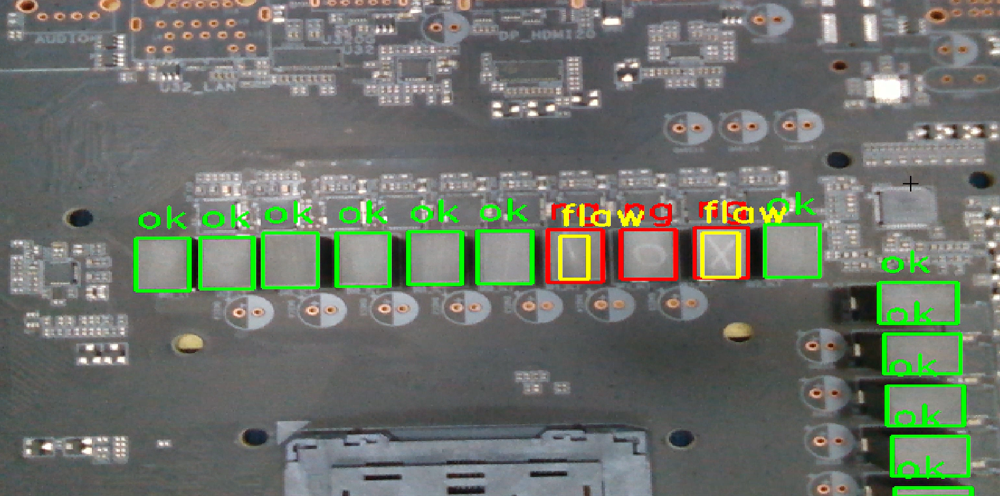

# Detecting objects combined with robotic arms | 偵測物件結合機器手臂
## Description | 介紹
設計 All in one 整合程式，在 \yolov8 底下執行 python all_in_one.py，藉由此單一程式可以完成所有訓練的工作。並結合攝像頭測試結果。

## Table of Contents | 目錄
- [**Preparatory work | 事前準備工作**](#Preparatory-work--事前準備工作)
- [**Testing phase | 測試階段**](#Testing-phase--測試階段)
- [**Precautions | 注意事項**](#Precautions--注意事項)

## Preparatory work | 事前準備工作
- 設置環境：這顆鏡頭雖然適用 python 3.6~3.8 ，但為了符合 1.1.1 版本的 OpenSSL，所以設置 python 版本 3.8 才行
- 拍攝照片：執行 Take photo.ipynb，安裝好攝像頭在機械手臂上每個點位各拍 100~200 張，總共約 500 張左右
- 手動框選物件，標籤照片物品使用 LabelImg 軟體
- 小元件瑕疵檢測
    - 若都是無標記或劃痕等等，設為 “ok”。
    - 有劃痕或異物在上面則，設為 “ng”。
    - 有干擾或是異物等則框，設為 “flaw”。
      
    - 卡槽開關檢測
      - 卡槽開關，開設為 “open”。
      - 卡槽開關，關設為 “close”。
      
## Testing phase | 測試階段
- 電腦連接 Intel(R) RealSense(TM) Depth Camera 415 選擇 RGB 鏡頭，執行 **Detect objects.ipynb** 會跳出鏡頭拍攝畫面的視窗
   
  (小元件瑕疵拍攝畫面)
  
  (卡槽開關檢測拍攝畫面)
## Precautions | 注意事項
- 拍攝時，盡量欲框取之物件要有明顯特徵、光線充分、多樣性的樣本、標註準確性、足夠的樣本數等等
- 目前我先把框取物體的信度顯示去掉
- 物體框線顏色可以設定，但順序是 B, G, R
- 視窗大小也可調整 (目前為 1920*1080 )
- **Detect objects.ipynb** 的第三部分「檢測單張照相物體」拍攝照片目前設定按 ”s”
- 關閉攝像頭視窗目前都設定為按 “q”
